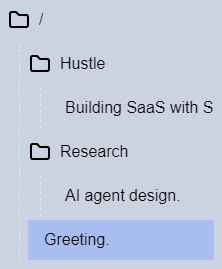
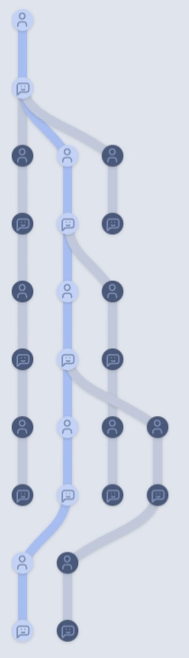

# Technologic - AI Chat


Technologic is a powerful, feature-rich AI Chatbot Client that is designed to work seamlessly with OpenAI's API or any
compatible backend. With a user-friendly interface and the ability to organize, modify, and manage your conversations,
Technologic brings you a next-level chatting experience with your AI assistant.


## Features

- **Secure Storage**: Your conversations are stored locally on your computer using your browser's IndexedDB storage.
- **Backend Compatibility**: Works with any backend compatible with OpenAI's API.
- **Bring Your Own API Key**: Easily configure your OpenAI API key or any other compatible backend.
- **Organize Conversations**: Keep your conversations tidy by organizing them into folders.
- **Message Modification**: Edit and modify messages, both sent and received, as needed.
- **Custom Personality**: Support for "System Messages" to give your chatbot a unique personality (if supported by the backend).
- **Fork Conversations**: Easily branch off into different topics without losing the context of previous conversations.
- **Elaborate**: Use the "Go on" feature to prompt the bot to expand on its last message.
- **Merge Messages**: Combine messages to avoid fragmentation or incomplete code blocks.
- **View Raw Message**: Access the raw text of any message with the flip of a switch.

## Screenshots

### Light Mode


### Dark Mode


### Folders


### Conversation Graph


## Installation

Clone the repository and navigate to the project directory:

```
git clone https://github.com/XpressAI/technologic.git
cd technologic
```

Install the dependencies:

```
npm install
```

Start the development server:
```
npm run dev
```

## Configuration

The entire configuration happens through the browser. Just click the little cog icon on the bottom right corner of the
sidebar.


## Developing

Once you've created a project and installed dependencies with `npm install` (or `pnpm install` or `yarn`), start a development server:

```bash
npm run dev

# or start the server and open the app in a new browser tab
npm run dev -- --open
```

## Usage

1. Configure the backend by pasting your OpenAI API key or any other compatible API key into the backend configuration.

2. Start chatting with the AI by typing your message in the input field and hitting "Send".

3. Organize your conversations by creating folders and moving conversations into them.

4. Modify messages by clicking on the message you want to edit.

5. Use the "Go on" feature by hitting "Send" with an empty message to prompt the bot to elaborate on its last message.

6. Merge messages by selecting two or more fragmented messages and clicking on the "Merge" button.

7. View the raw text of a message by clicking the "Flip" button on the message.

## FAQs

**Q: Is my data secure?**

A: Yes, Technologic stores all your conversations locally on your computer using your browser's IndexedDB storage.

**Q: Can I use Technologic with other backends apart from OpenAI's API?**

A: Absolutely! Technologic is designed to work with any backend that is compatible with OpenAI's API. Just configure the backend and you're good to go.

**Q: How can I give my AI chatbot a custom personality?**

A: Technologic supports "System Messages" that allow you to give your chatbot a unique personality. This feature is available if your chosen backend supports it.

## Contributing

We welcome contributions to Technologic!

## License
Technologic is licensed under the MIT License. See the [LICENSE](LICENSE) file for more details.
